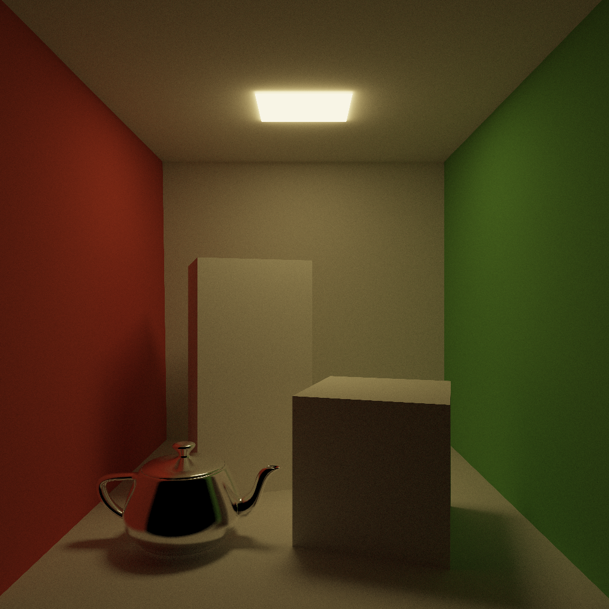
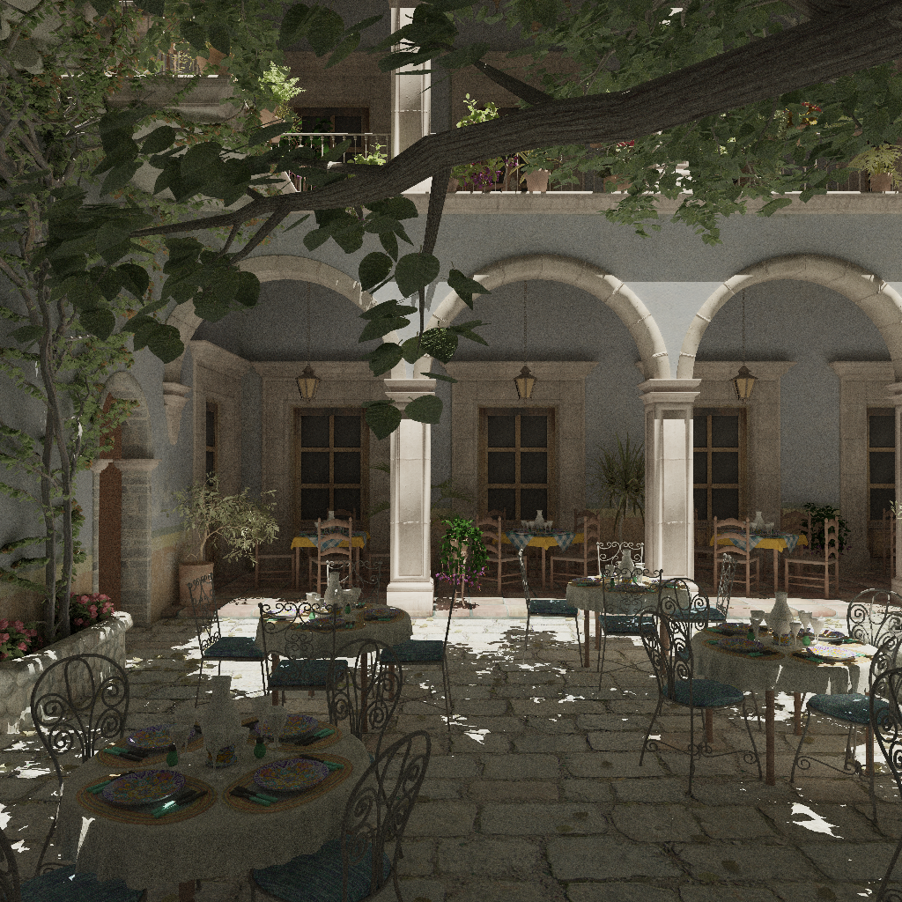
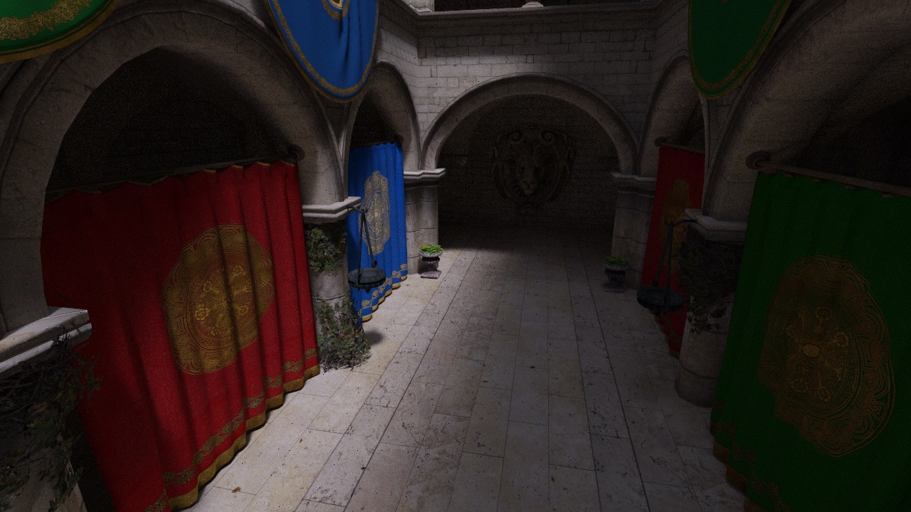
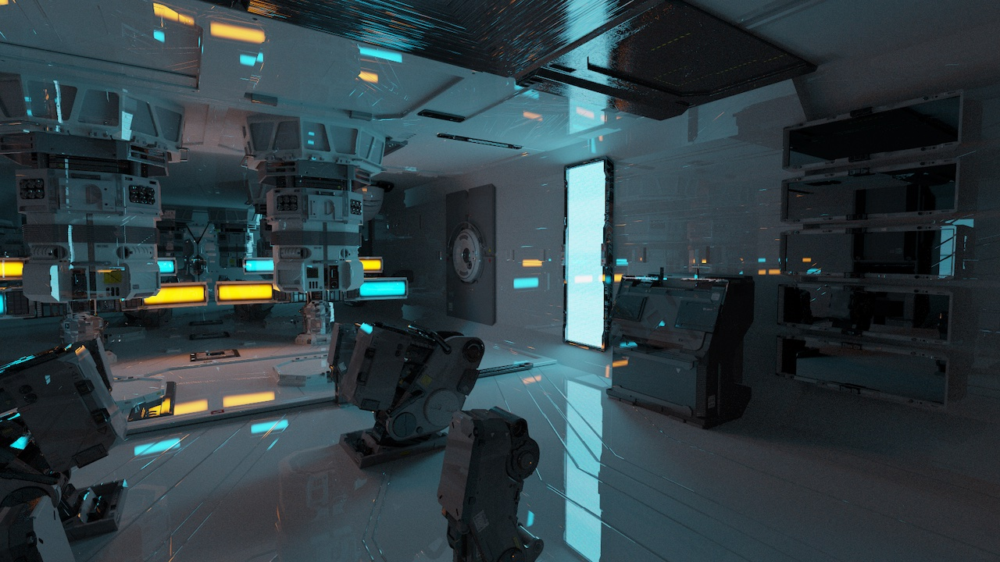

prt - Playground for Ray Tracing
================================

This is a playground repository for ray tracing-related experiments. The implementation is done from scratch, using CPU, and referencing various resources, especially [Physically Based Rendering From Theory to Implementation](https://www.pbr-book.org/).

Features
--------
* Support for acceleration with CPU SIMD
  * Architectures
    - [x] Arm Neon
    - [x] SSE/AVX (No support for AVX-512)
  - Computations
    - [x] N rays - triangle intersection
    - [x] Ray - N triangles intersection
    - [x] N rays - BBox intersection
    - [x] Ray - BBox intersection
    - [ ] Bilinear filtering
* Acceleration structures
  - [x] BVH for triangle mesh
    - Two children, and multiple triangles in leaf node
* Ray packet tracing
  - [x] Primary rays
  - [x] Occlude rays
  - [ ] Secondary rays/binning
  - [ ] Compaction
* Path tracing
  - [x] Indirect diffuse
  - [x] Perfect specular
  - [x] Emissive
  - [ ] BSDF
  - [ ] Refraction
  - [ ] Volumetric
* Direct lights
  - [x] Directional light
  - [x] Infinite area light
  - [ ] Point light
  - [ ] Spot light
* Texture mapping
  - [x] Diffuse
  - [x] Alpha mask
  - [x] Bump
  - [x] Bilinear filtering
  - [ ] Mipmapping
  - [ ] Tiled access
* Camera

Supported platforms
-------------------
The code is developed primarily on macOS, but should work on other platforms.
* macOS x86/Apple M1
* Windows
* Raspberry Pi

How to build
------------
Use CMake to build

Rendered images
---------------

Cornell Box + Teapot
--------------------

San Miguel
----------

san-miguel-low-poly from https://casual-effects.com/data/

Sponza
------

Crytek Sponza from https://casual-effects.com/data/

Zero-Day
------

https://developer.nvidia.com/orca/beeple-zero-day

External repositories
---------------------
* [stb](https://github.com/nothings/stb)
* [tinyobjloader](https://github.com/tinyobjloader/tinyobjloader)
* [Tiny OpenEXR image library](https://github.com/syoyo/tinyexr)

References
----------
* [Physically Based Rendering From Theory to Implementation](https://www.pbr-book.org/)
* [Watertight Ray/Triangle Intersection](https://jcgt.org/published/0002/01/05/)
* [Fast, minimum storage ray/triangle intersection](https://en.wikipedia.org/wiki/M%C3%B6ller%E2%80%93Trumbore_intersection_algorithm)
* [Spatial Splits in Bounding Volume Hierarchies](https://www.nvidia.in/docs/IO/77714/sbvh.pdf)