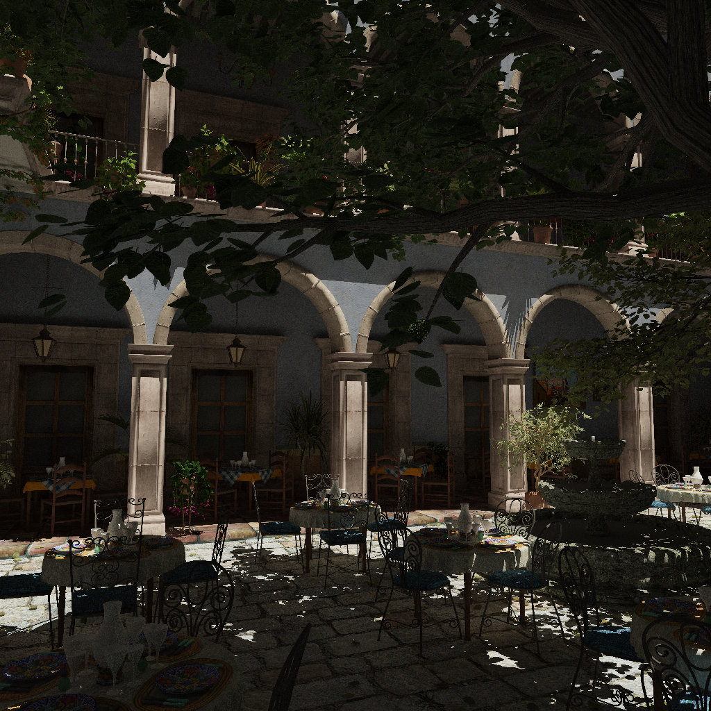

prt - Playground for Ray Tracing
================================

This is a playground repository for ray tracing-related experiments. The implementation is done from scratch, using CPU, and referencing various resources, especially [Physically Based Rendering From Theory to Implementation](https://www.pbr-book.org/).

Features
--------
* Support for SIMD instructions
  - [x] Arm Neon
  - [x] SSE/AVX
* Acceleration structures
  - [x] BVH for triangle mesh
* Ray packet tracing
  - [x] Primary rays
  - [x] SIMD for processing multiple rays in packet
  - [ ] Secondary rays/binning
  - [ ] Compaction
* Path tracing
  - [x] Indirect diffuse
  - [x] Perfect specular
  - [x] Emissive
  - [ ] BSDF
  - [ ] Refraction
  - [ ] Volumetric
* Direct lights
  - [x] Directional light
  - [ ] Infinite light
  - [ ] Point light
  - [ ] Spot light
* Texture mapping
  - [x] Diffuse
  - [x] Alpha mask
  - [x] Bump
  - [x] Bilinear filtering
  - [ ] Mipmapping
* Camera

Supported platforms
-------------------
The code is developed primarily on macOS, but should work on other platforms.
* macOS x86/Apple M1
* Windows
* Raspberry Pi

How to build
------------
TODO

Rendered images
---------------

Cornell Box + Teapot @2048spp
-----------------------------

San Miguel @128spp
-----------------

san-miguel-low-poly from https://casual-effects.com/data/
